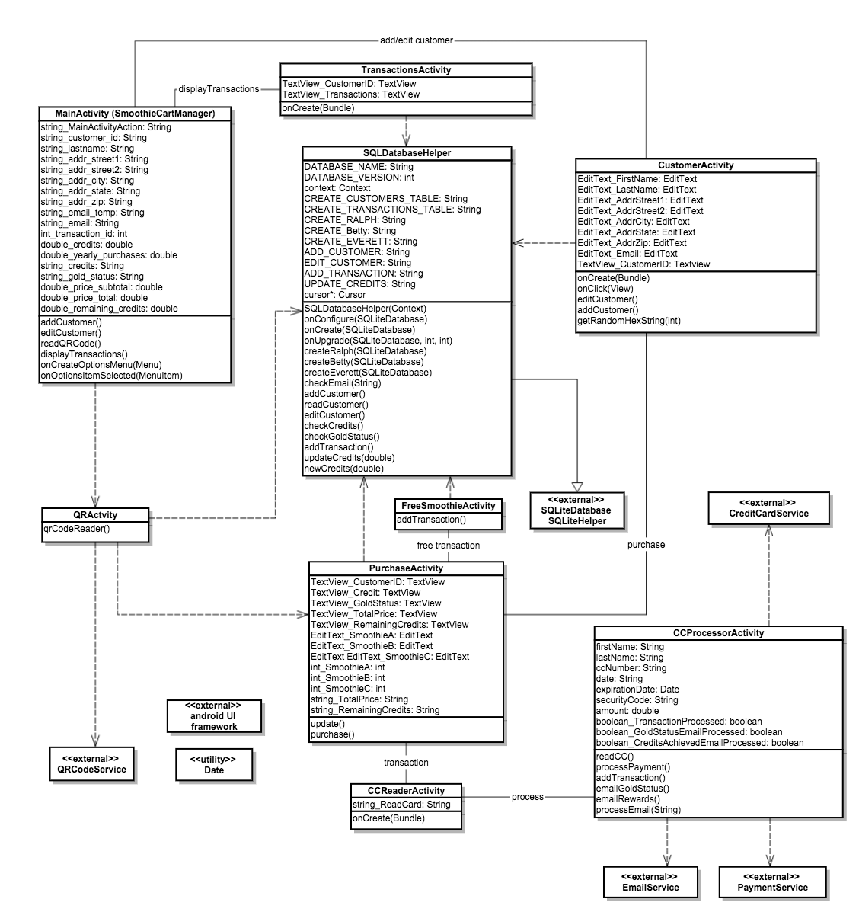
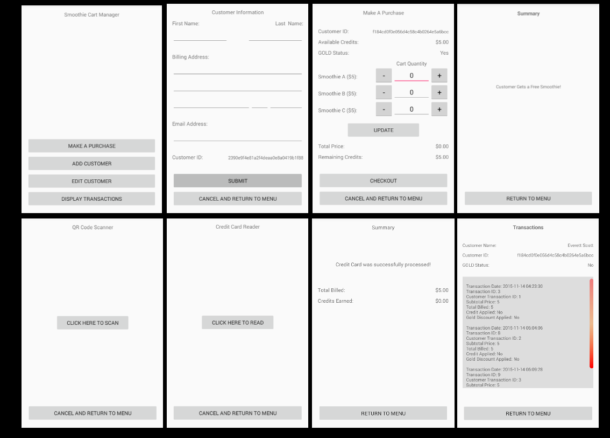
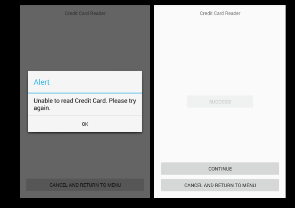

# Design Document

**Author**: Team 30

## 1 Design Considerations

### 1.1 Assumptions

The Smoothie Cart Manager software is provided as an Android application with the capability to scan a QR code and read a credit card. All QR cards are created and distributed by a third-party.

### 1.2 Constraints

The constraints we're faced with are the implementation of an actual credit card scanner & QR Code scanner, which depend on external hardware for testing. Both can be referenced as separate classes using external Java libraries.  Additional external libraries for email service and payment processing will be used.

### 1.3 System Environment

The main system for this application is either a smartphone or tablet installed with Android 4.4 (KitKat) or higher with minimum screen resolution of 1280Lx720W. Only portrait orientation-mode is supported.

## 2 Architectural Design

### 2.1 Component Diagram

The Android application contains 9 classes: MainActivity, CCProcessorActivity, CCReaderActivity, CustomerActivity, FreeSmoothieActivity, PurchaseActivity, QRActivity, SQLDatabaseHelper, and TransactionsActivity.  A more detailed diagram of each class and their components can be found in section 3.1 as a UML class diagram.

### 2.2 Deployment Diagram

This application will be installed on an Android device.  A more detailed diagram of the software components can be found in section 3.1 as a UML class diagram.

## 3 Low-Level Design

### 3.1 Class Diagram

Below is the UML class diagram for the Smoothie Cart Manager software.

## 4 User Interface Design

Below is the UI design for the SmoothieCartManager Android application.

The application contains 8 screens, with the first (default) being the main menu (Smoothie Cart Manager/Main Activity).  From the main menu, you are able to navigate to the following screens:

* Customer Information
* Make A Purchase
* QR Code Scanner
* Free Smoothie(s)
* Credit Card Reader
* Credit Card Processor
* Transactions

Dynamic content and pop-up windows are used to alert the user that specific conditions have been met. For example, the Credit Card Reader screen may display an alert window in response to an error condition (left screen) or update dynamic text on the screen itself to show success (right screen):

