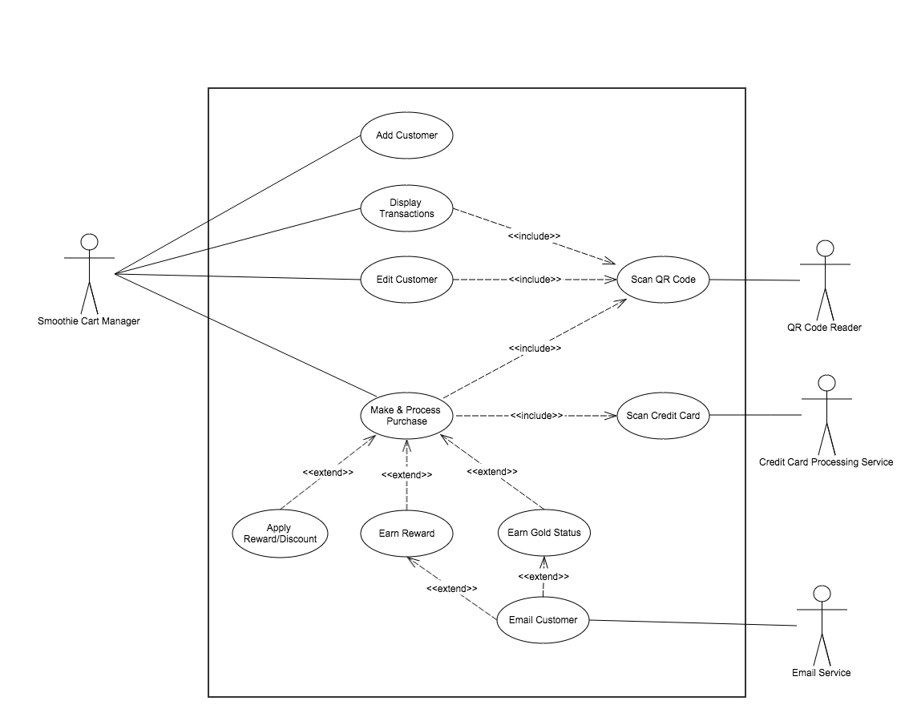

# Use Case Model

**Author**: Team 30

## 1 Use Case Diagram

The Smoothie Cart Manager is the only person working at the cart and using the system.

## 2 Use Case Descriptions

### 2.1 Use Case: Add Customer

**Requirements:**
This use case describes how the Smoothie Cart Manager adds a new customer to the system.

**Pre-conditions:**
* The Android device that the system is running on is functioning
* The customer must be willing to provide their name, billing address, and e-mail address

**Post-conditions:**
* The customer is assigned a customer card with QR code encoded customer's ID, and is their information is stored locally on the Android device.

**Scenarios:**

**Basic Flow of Events**

1. The use case begins when a new customer would like to make a purchase
2. Smoothie Cart Manager starts the application
3. The application displays the main menu
4. Smoothie Cart Manager selects "Add Customer"
5. The application displays "Customer Information" screen
6. The application generates and displays a 32-digit hexadecimal Customer ID
7. Smoothie Cart Manager enters the customer's (1) first name (2) last name (3) billing address (4) email address and clicks "Submit"
8. The application stores the customer information.
9. Third party provides physical customer card. The customer card contains a QR code that encodes the customer’s ID.
10. The use case ends successfully.

**Alternative Flow: Customer email address was not entered**

If in step 7, if the manager did not complete the email address field:
* The application will display a message indicating that the manager should enter an email address.
* The Smoothie Cart Manager clicks OK
* The Smoothie Cart Manager enters an email address and clicks "Submit", and returns to step 8.
* Otherwise, the Smoothie Cart Manager clicks on the back button to return to the main menu.  The customer is not added.  The use case ends.

**Alternative Flow: Customer email address already exists**

If in step 7, the email address already exists:
* The application will display a message indicating that the email already exists.
* The Smoothie Cart Manager enters a new email address and clicks "Submit", and returns to step 8.
* Otherwise, the Smoothie Cart Manager clicks on the back button to return to the main menu.  The customer is not added.  The use case ends.

**Alternative Flow: Cancel**

If at any point prior to clicking the "Submit" button in step 7, the manager clicks "Cancel and Return To Menu" or clicks on the device's back button, then:
* The customer is not added to the system.
* The use case ends

### 2.2 Use Case: Edit Customer

**Requirements:**
This use case describes how the Smoothie Cart Manager edits a customer in the system.

**Pre-conditions:**
* The Android device that the system is running on is functioning.
* There is a QR Code reader

**Post-conditions:**
* The customer's information will be updated

**Scenarios:**

**Basic Flow of Events**

1. The use case begins when a customer has updated information to provide.
2. Smoothie Cart Manager starts the application
3. The application displays main menu
4. Smoothie Cart Manager selects "Edit Customer"
5. The application prompts Smoothie Cart Manager to scan QR code on the customer's card by displaying the QR Code Scanner screen
6. Smoothie Cart Manager selects "Click Here To Scan"
7. The application scans and decodes the QR code (customer ID)
8. Smoothie Cart Manager selects "Continue"
9. The application displays the "Customer Information" screen
10. Smoothie Cart Manager enters customer's new information which may include one or more of the following: (1) first name (2) last name (3) billing address (4) email address and clicks on "Submit"
11. The application stores the updated customer information
12. The use case ends successfully

**Alternative Flow: Unable to read QR card**

If in step 7, the QR code could not be read:
* An alert message will be displayed.  
* The manager may try scanning again by clicking on "OK" and returning to step 6.
* Alternatively, the manager can click on "Cancel and Return to Menu" and the use case ends.

**Alternative Flow: Customer email address was not entered**

If in step 10, if the manager removed the email address field:
* The application will display a message indicating that the manager should enter an email address.
* The Smoothie Cart Manager clicks OK
* The Smoothie Cart Manager enters an email address and clicks "Submit", and returns to step 11.
* Otherwise, the Smoothie Cart Manager clicks on the back button to return to the main menu.  The customer is not added.  The use case ends.

**Alternative Flow: Customer email address already exists**

If in step 10, the email address already exists:
* The application will display a message indicating that the email already exists.
* The Smoothie Cart Manager enters a new email address and clicks "Submit", and returns to step 11.
* Otherwise, the Smoothie Cart Manager clicks on "Cancel and Return to Menu" and the use case ends. The customer information is not edited.  The use case ends.

**Alternative Flow: Cancel**

If at any point prior to clicking the "Submit" button in step 10, the manager clicks "Cancel and Return To Menu" or closes the application, then:
* The customer information is not edited.
* The use case ends

### 2.3 Use Case: Process Purchase (Make A Purchase)

**Requirements:**
This use case describes how the Smoothie Cart Manager processes purchases in the system.

**Pre-conditions:**
* The Android device that the system is running on is functioning
* There is a QR code reader
* There is a credit card scanner
* There is a payment processor
* There is an e-mail service provider

**Post-conditions:**
* Customer's purchase will be processed minus applicable discounts and credits
* Customer's credit card payment will be processed (if applicable)
* Customer will earn rewards (credit) and gold status if applicable, and will receive an email of such where applicable
* Customer's transaction will be stored locally on the device

**Basic Flow of Events**

1. The use case begins when a customer would like to purchase smoothie(s) from the Smoothie Cart Manager
2. Smoothie Cart Manager starts the application
3. The application displays main menu
4. Smoothie Cart Manager selects "Make a Purchase"
5. The application displays the QR Code Scanner screen
6. The Smoothie Cart Manager clicks "Click Here To Scan"
7. The application scans and decodes the QR code (customer ID)
8. The Smoothie Cart Manager selects "Continue"
9. The application displays the "Make A Purchase" screen with customer ID, available credits, and gold status
10. Smoothie Cart Manager enters the number of smoothies to be purchased
11. The Smoothie Cart Manager clicks on "Update"
12. The application calculates and displays the discounted total and remaining credits
13. The Smoothie Cart Manager clicks on "Checkout"
14. The application displays the Credit Card Reader screen
15. The Smoothie Cart Manager clicks "Click Here to Read"
16. The credit card is read
17. The Smoothie Cart Manager clicks the "Continue" button
18. The application sends the credit card information to the external processing credit card service
19. The application determines if the purchase entitled the customer to earn rewards, if so it will send an email to the customer
20. The application determines if the purchase entitled the customer to earn Gold Status, if so it will send an email to the customer
21. The application displays the "Summary" screen with total billed, any credits earned and if gold status was achieved.
23. The Smoothie Cart Manager clicks "Return to Menu"
24. The application displays the main menu.
25. The use case ends successfully

**Alternative Flow: Unable to read QR card**

If in step 7, the QR code could not be read:
* An alert message will be displayed.  
* The manager may try scanning again by clicking on "OK" and returning to step 6.
* Alternatively, the manager can click on "Cancel and Return to Menu" and the use case ends.

**Alternative Flow: Free Smoothie**

If at step 13, the net total is $0 (i.e. the customer has enough credit to cover the purchase):
* A summary screen will be displayed with the message "Customer Gets a Free Smoothie!"
* The manager informs the customer of their free smoothie, and clicks on "Return To Menu"
* The use case ends.

**Alternative Flow: Unable to read Credit Card**

If at step 16 the application is unable read credit card information:
* An alert message will be displayed.  
* The manager may try scanning again by clicking on "OK", then clicking on "Click Here To Read" button, and returning to step 16.
* Alternatively, the manager can click on "OK" and "Cancel and Return To Main Menu" to cancel, and the use case ends.

**Alternative Flow: Credit Card was declined**

If at step 18 the credit card is declined:
* An alert message will be displayed.  
* The manager may try scanning again by clicking on "OK", then clicking on "Retry Processing Credit Card" button, and returning to step 18.
* Alternatively, the manager can click on "OK" and "Cancel and Return To Main Menu" to cancel, and the use case ends.

**Alternative Flow: E-mail was not sent**
If at step 19 or 20 e-mail failed:
* An alert message will be displayed.
* The manager may retry sending email by clicking on "OK" then clicking on the "Retry Sending Email" button and return to step 21.

**Alternative Flow: Cancel**

If at any point prior to step 17 the manager returns to the main menu then:
* The purchase is not processed.
* The use case ends.

**Alternative Flow: Cannot hit back button after purchase is complete**

If after submitting the purchase, the manager clicks on the back button:
* An alert window will appear indicating that the user cannot return to the previous page.
* Click on OK
* Click on the Return to Main Menu button to return to the main menu.

### 2.4 Use Case: Display Transactions

**Requirements:** This use case describes how the Smoothie Cart Manager lists transactions for any customer

**Pre-conditions:**
* The Android device that the system is running on is functioning

**Post-conditions:**
* The Smoothie Cart Manager will be presented with a list of transactions for the customer of interest

**Scenarios:**

**Basic Flow of Events**

1. The use case begins when the Smoothie Cart Manager would like to display a customer's transaction history
2. Smoothie Cart Manager starts the application
3. The application displays main menu
4. Smoothie Cart Manager selects "Display Transactions"
5. The application displays the QR Code Scanner screen
6. The Smoothie Cart Manager clicks "Click Here To Scan"
7. The application scans and decodes the QR code (customer ID)
8. The Smoothie Cart Manager selects "Continue"
9. The application displays "Transactions" screen with the customer name, customer ID, gold status, and list of transactions with date, transaction id, subtotal price, total billed, credit applied, and gold discount applied.
10. The Smoothie Cart Manager clicks "Return to Menu"
10. The application displays the main screen.
11. The use case ends successfully.

**Alternative Flow: Unable to read QR card**

If in step 7, the QR code could not be read:
* An alert message will be displayed.  
* The manager may try scanning again by clicking on "OK" and returning to step 6.
* Alternatively, the manager can click on "Cancel and Return to Menu" and the use case ends.
