# User Manual

**Author**: Team 30

## 1. Introduction

Smoothie Cart Manager is an Android application that provides a way for you to manage your smoothie cart customers, payments and rewards.  

This guide will provide a brief overview of the system and walk you through the basic steps of using Smoothie Cart Manager including how to add a new customer, edit an existing customer, process payments, and display customer transactions.

### 1.1 Features

Through the use of third party software and providers, Smoothie Cart Manager app provides the following features:

* QR code reading
* Credit card scanning
* Credit card payment-processing
* Reward and Gold Status e-mail notifications.
* Customer transaction history

### 1.2 Rewards and Gold Status

Every time a customer spends $50 or more in a single purchase, he/she receives a $5 credit towards his/her next purchase.

The following rules apply:
* The credit expires after one year.
* The credit is applied towards the customer's next purchase.
* To earn the $5 credit, the customer must pay $50+ net.
* The system will send an email to a customer when he/she earns credit.
* Customers who spend $500 or more in a calendar year achieve "gold" status, which entitles them to a 5% discount for life and on every purchase.

### 1.3 System Requirements

The Smoothie Cart Manager application is designed to run on either a smartphone or tablet with Android 4.4 (KitKat) or higher with minimum screen resolution of 1280Lx720W. Only portrait orientation-mode is supported.

### 1.4 Limitations
* Users are limited to purchasing 99 smoothies of each type per order

## 2. Using Smoothie Cart Manager

To start the application, click on the Smoothie Cart Manager application icon on your Android device's screen.  The application will display the Smoothie Cart Manager main menu:

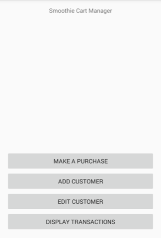

### 2.1 Adding a new customer

To add a new customer:

1. From the Smoothie Cart Manager main menu, click on **Add Customer**
2. The application will display the **Customer Information** screen: 
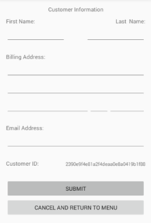

3. Enter the new customer's information (Email Address is mandatory):
<ul>
<li>First Name</li>
<li>Last Name</li>
<li>Billing Address</li>
<li>Email Address</li>
</ul>
4. A **Customer ID** will be automatically assigned and displayed
5. Click on **Submit** to add the customer to the system.

#### 2.1.1 Please type a valid email address
If no email address is entered, the application will display a message indicating so.  
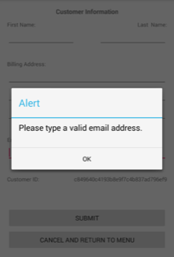

* Click on OK
* Complete the email address field, and click the **Submit** button to resubmit.

#### 2.1.2 Customer email address already exists
If an email address that already exists is entered, the application will display a message that it already exists:  
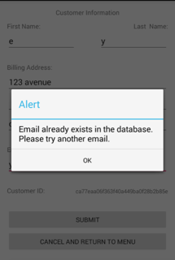

* Correct the issue by entering a new email address and resubmitting the action by clicking the **Submit** button.
* Alternatively, you may exit the action by clicking on the device's back button.  

#### 2.1.3 Canceling

* Before clicking **Submit**, you may cancel the current action by clicking on the **Cancel and Return To Menu** button or clicking the device's "Back" button

### 2.2 Editing a customer

To edit a customer's information:

1. From the Smoothie Cart Manager main menu, click on **Edit Customer**
2. The application will display the **QR Code Scanner** screen.
3. Scan the QR code on the customer's card by clicking on **Click Here To Scan**: 
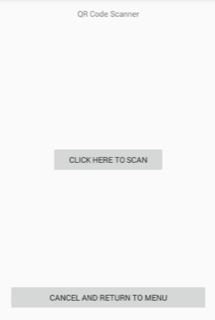

4. If the scan is successful, the Continue button will appear.  Click on the **Continue** button to proceed. 
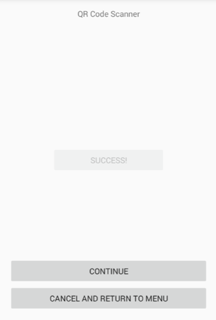

5. The application will display the **Customer Information** screen.
6. Edit any of the following customer information:
<ul>
<li>First Name</li>
<li>Last Name</li>
<li>Billing Address</li>
<li>Email Address</li>
</ul>
*Note: The customer ID cannot be modified.  Email Address is mandatory.*
 

7. Click **Submit** to make the changes effective.

#### 2.2.1 Unable to read QR card. Please try again.

If the QR code service returns an error, an alert window will appear on the screen.  Click on OK and try again.  
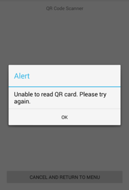

#### 2.2.2 Please enter a valid email address
If no email address is entered, the application will display a message indicating so.  

* Click on OK
* Complete the email address field, and click the **Submit** button to resubmit.

#### 2.2.3 Customer email address already exists
If an email address that already exists is entered:
* The application will display a message that it already exists.
* Correct the issue by entering a new email address and resubmitting the action by clicking the **Submit** button.
* Alternatively, you may exit the action by following section 2.2.3 below.

#### 2.2.4 Canceling

* Before clicking **Submit**, you may cancel the current action by clicking on the **Cancel and Return To Menu** button or clicking the device's "Back" button

### 2.3 Processing a purchase ("Make A Purchase")

To process a purchase:

1. From the Smoothie Cart Manager main menu, click on **Make A Purchase**
2. The application will display the **QR Code Scanner** screen.
3. Scan the QR code on the customer's card by clicking on **Click Here To Scan**:  

4. If the scan is successful, the Continue button will appear.  Click on the **Continue** button to proceed.  

5. The application will display the **Make A Purchase** screen:  
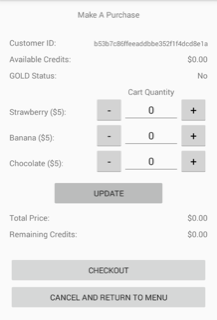

6. Enter the number of smoothies the customer would like to purchase either by entering a quantity directly into the number field, or using the (+) or (-) buttons to toggle the quantity.  You may enter a maximum of 99 smoothies per type of smoothie.
7. Click **Update**
8. The application will calculate and display the total after discounts.
9. Review the order, if you are satisfied with the information, click on **Checkout**.  
  * If your order is empty, an alert message will be displayed to remind you to add items to the order (If so, click OK to update your order).  
  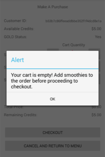

  * If the net total of the purchase after discounts and rewards is $0, a summary screen will be display the message "Customer Gets a Free Smoothie!".  Click on "Return To Menu" to return to the main menu.  Your transaction is complete, **skip the remaining steps in this section**.  
  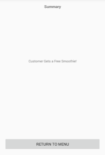

10. The application will display the **Credit Card Reader** screen:  
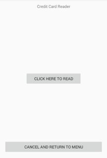

11. Click on **Click Here To Read** to scan the credit card.
12. If the credit card is read successfully, a success message will be displayed.  
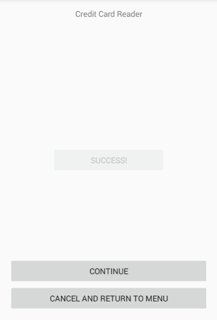

13. Click on **Continue** to proceed.
14. The application will display the **Summary** screen. In the background, application will:
<ul>
<li>send the credit card information to the external processing credit card service</li>
<li>determines if the purchase entitled the customer to earn rewards, if so it will send an email to the customer</li>
<li>determines if the purchase entitled the customer to earn Gold Status, if so it will send an email to the customer</li>

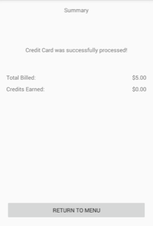

15. The application will display the credits earned as well as if gold status has been achieved.  
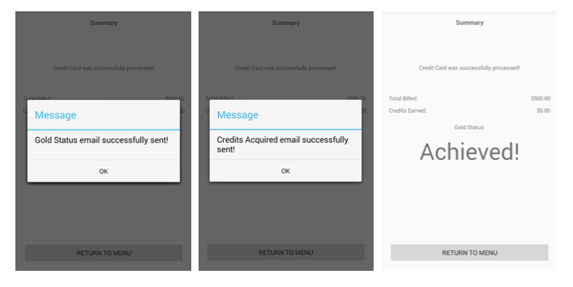

16. To return to the main menu, click on **Return to Menu**

#### 2.3.1 Unable to read QR card. Please try again

If the QR code service returns an error, an alert window will appear on the screen.  

* Click on OK
* Click on "Click Here To Scan" to try again
* Or, if you prefer to cancel, click on "Cancel and Return to Main Menu"

#### 2.3.2 Unable to read Credit Card. Please try again

If the credit card reader service returns an error, an alert window will appear on the screen.  
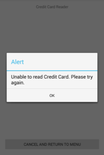

* Click on OK
* Click on "Click Here To Read" to try again
* Or, if you prefer to cancel, click on "Cancel and Return to Main Menu"

#### 2.3.3 Unable to process credit card payment

If the payment processing service declines the credit card, an alert window will appear on the screen.  
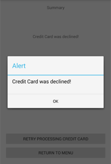

* Click on OK
* Click on "Retry Processing Credit Card" to try again
* Or, if you prefer to cancel, click on "Cancel and Return to Main Menu"

#### 2.3.4 E-mail could not be sent

If e-mail notification failed to be sent, an alert window will appear on the screen.
* Click on OK
* Click on "Retry Sending Email..." if you would like the application to try again.

#### 2.3.5 Canceling

Prior to clicking **Continue** on the **Credit Card Reader** screen, you may cancel the order by clicking on **Cancel and Return To Menu** button.

#### 2.3.6 Cannot hit back button after purchase is complete

If after submitting the purchase, you click on the back button, an alert window will appear indicating that the user cannot return to the previous page.
* Click on OK
* Click on the Return to Main Menu button to return to the main menu.

### 2.4 Displaying Transactions

To display transactions for any customer:

1. From the Smoothie Cart Manager main menu, click on **Display Transactions**
2. The application will display the **QR Code Scanner** screen
3. Scan the QR code on the customer's card by clicking on **Click Here To Scan**:  

4. If the scan is successful, the Continue button will appear.  Click on the **Continue** button to proceed.  

5. The application will display the **Transactions** screen:  
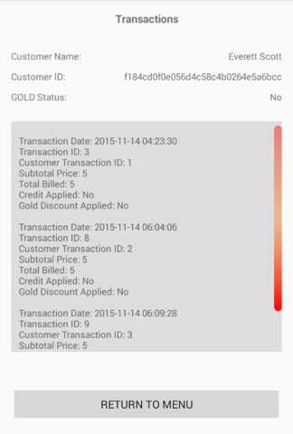

6. To exit the **Transactions** screen, click on **Return to Menu**

#### 2.4.1 Unable to read QR card. Please try again

If the QR code service returns an error, an alert window will appear on the screen.  Click on OK and try again.  

#### 2.4.2 Canceling

* From the QR Code Scanner page, you may cancel the current action by clicking on **Cancel and Return To Menu** or your device's **Back** button.  

## 3. Additional Support

For additional support, contact Team 30 (6300Fall15Team30@example.com).

## 4. Glossary

**customer ID** - the customer ID is a 32-digit unique hexadecimal ID

**QR code** - short for "Quick Response Code" is a type of barcode.  It is used in this application to encode the customer's ID.
